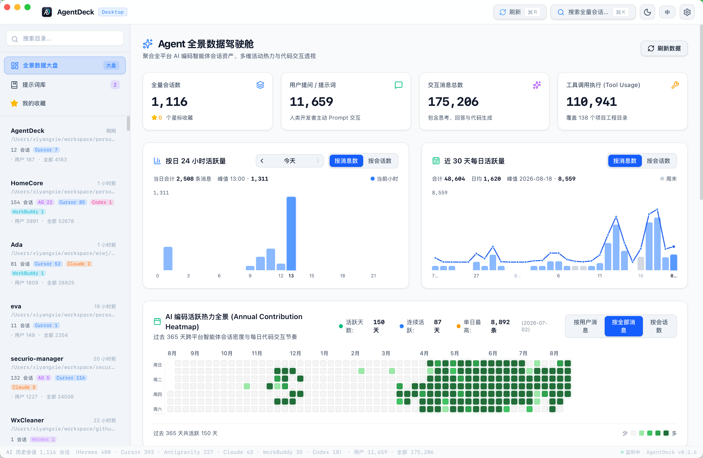
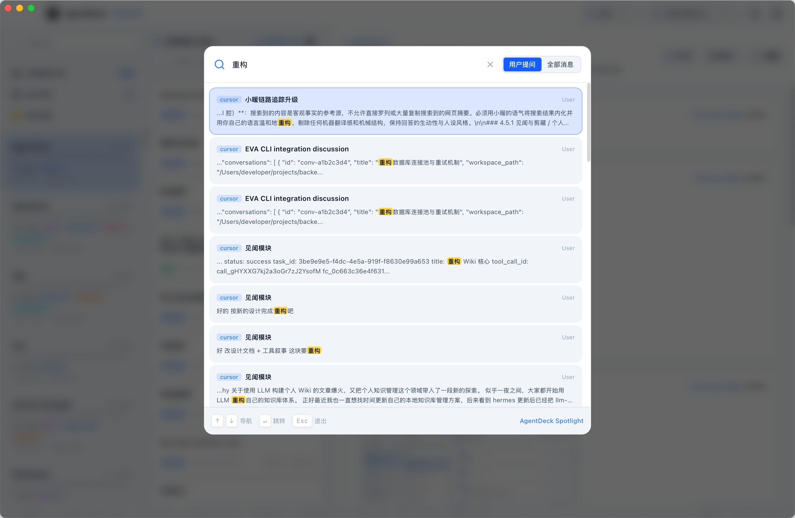
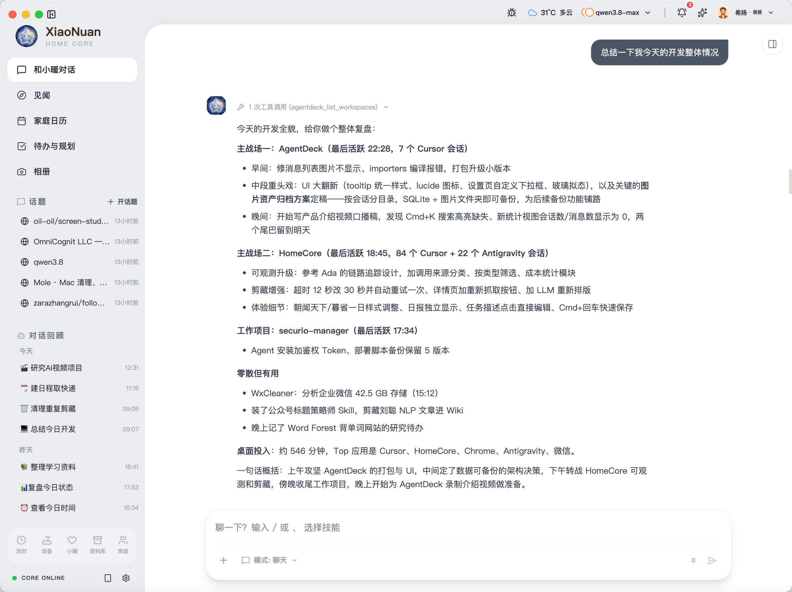

# AgentDeck

[](LICENSE)
[](https://github.com/lepfinder/AgentDeck/releases/latest)
[](https://github.com/lepfinder/AgentDeck/releases/latest)
[](https://github.com/lepfinder/AgentDeck/releases)
[](https://github.com/lepfinder/AgentDeck/stargazers)
[](https://github.com/lepfinder/AgentDeck/actions/workflows/ci.yml)

[English](./README.md)

采集本机所有 coding agent 的会话与消息，在一处完成统一管理、检索与分析。基于 **Tauri 2 + Rust + React** 的原生桌面应用。

Cursor、Antigravity、Claude Code、Codex、Hermes、WorkBuddy 各自维护独立的会话目录。AgentDeck 只读同步到 SQLite，媒体本地镜像，并提供回环 REST API，供其他 Agent 实时查询与复盘。



---

[功能](#功能) | [AI Agent 友好](#ai-agent-友好) | [下载安装](#下载安装) | [支持的 Agent](#支持的-agent) | [快速开始](#快速开始) | [本机 API](#本机-api) | [数据目录](#数据目录)

---

## 功能

- **全景数据大盘** -- 会话数、用户提问、消息量、工具调用；按来源 / 时段 / 项目分布。
- **三栏会话浏览** -- 工作区导航、会话卡片、Markdown 消息流；支持星标收藏与快捷筛选。
- **Spotlight 搜索（⌘K）** -- 跨会话全文检索，支持角色筛选与跳转定位。
- **提示词库** -- 独立收藏外部 prompt（分类、标签、来源备注），不绑定某一条会话。
- **项目分析** -- 按工作区生成复盘报告与功能模块提取，可配置 LLM 供应商。
- **在 AI IDE 中打开** -- 选中项目后，可从会话列表用 Cursor / Antigravity 打开目录，或在终端启动 Claude Code / Codex。
- **本机 REST API** -- `127.0.0.1:8788`，免 Token，仅回环网卡；交互文档见 `/docs`。
- **备份与媒体归档** -- SQLite 热快照、媒体镜像到 `~/.agentdeck/media/`。
- **中英双语 + 主题** -- 界面支持中文 / English；深色 / 浅色主题切换。



---

## AI Agent 友好

AgentDeck 不只是给人看的浏览器 -- 它提供**面向 AI Agent 的标准本机 REST API**，让其他智能体接入后，对你的编程历史做**动态、实时**的分析与复盘。

- **本机回环、零配置** -- `127.0.0.1:8788`，免 Token、不上云；本地 Agent、脚本或 MCP 工具可直接调用。
- **读写在关键场景打通** -- 查询统计、工作区、会话、全文检索与用户消息导出；通过 `POST /api/prompts` 把优质 prompt 写回提示词库。
- **数据实时而非静态快照** -- 先 `POST /api/sync` 刷新归档，再拉最新会话，做跨项目日报、周复盘、投入分析。
- **接口自描述** -- `/docs` 在线调试；`GET /api/docs/markdown` 导出完整 Markdown 规范，方便塞进 Agent 的 system prompt。

把接口封装成 HTTP Tool 或 MCP Function 即可 -- 例如列出今日活跃工作区、检索近期提问、汇总 Cursor / Antigravity / Claude Code 的开发全貌。



典型 Agent 工作流：

| 目标 | 接口 |
|---|---|
| 全局概览 | `GET /api/stats` |
| 列出 / 筛选项目 | `GET /api/workspaces`、`GET /api/workspaces/detail` |
| 拉取用户提问做分析 | `GET /api/user-messages`、`GET /api/search` |
| 分析前刷新数据 | `POST /api/sync` |
| 沉淀可复用 prompt | `POST /api/prompts`、`GET /api/prompts` |

更多细节见下方 [本机 API](#本机-api) 章节。

---

## 支持的 Agent

AgentDeck 监听本地 Agent 数据目录，将会话同步到自有 SQLite 归档库。对源文件的解析均为**只读**。

| Agent | 支持情况 |
|---|---|
| Cursor | 完整会话与消息同步；附图本地归档 |
| Antigravity | 完整会话与消息同步；附图本地归档 |
| Claude Code | 会话历史同步 |
| Codex | 会话历史同步 |
| Hermes | 会话历史同步 |
| WorkBuddy | 会话历史同步 |

数据默认保存在本机 `~/.agentdeck/`，不会上传到云端。

---

## 下载安装

预编译包见 [GitHub Releases](https://github.com/lepfinder/AgentDeck/releases/latest)。

### macOS

1. 下载 **`AgentDeck-<version>-macos-aarch64.zip`**（Apple Silicon）或 **`-macos-x64.zip`**（Intel）
2. 解压后将 **AgentDeck.app** 拖入「应用程序」

应用为 ad-hoc 签名，首次打开可能被 Gatekeeper 拦截：**右键 → 打开 → 打开**，或在终端执行：

```bash
xattr -d com.apple.quarantine /Applications/AgentDeck.app
```

**要求：** macOS 14+（下方提供 Apple Silicon / Intel 安装包）

也可 [从源码构建](#从源码运行)。

---

## 快速开始

### 环境要求

| 工具 | 说明 |
|---|---|
| macOS | 14+（Apple Silicon 或 Intel） |
| Node.js | 建议 18+ |
| Rust | Stable 工具链 + Tauri 2 系统依赖 |
| Xcode | Command Line Tools |

### 从源码运行

```bash
git clone https://github.com/lepfinder/AgentDeck.git
cd AgentDeck
npm install
npm run tauri dev
```

REST API 随应用启动：

- 健康检查：`http://127.0.0.1:8788/health`
- 接口文档：`http://127.0.0.1:8788/docs`

### 打包发布

```bash
npm run tauri build
```

产物在 `src-tauri/target/release/bundle/`。发版时同步改这三处版本号：

1. `package.json`
2. `src-tauri/Cargo.toml`
3. `src-tauri/tauri.conf.json`

并更新 `CHANGELOG.md`。打包前会执行 `npm run generate:api-docs`，生成 `src-tauri/src/api_docs.generated.md`。

### 发布新版本（维护者）

推送 **`v*`** 标签会触发 [`.github/workflows/release.yml`](.github/workflows/release.yml)：自动打包 macOS（Apple Silicon + Intel）并创建 GitHub Release（含 macOS `xattr` 安装说明）。

```bash
# 1. 同步改 package.json、src-tauri/Cargo.toml、src-tauri/tauri.conf.json 版本号
# 2. 更新 CHANGELOG.md
git add -A && git commit -m "chore: release v0.2.7"
git tag v0.2.7
git push origin main --tags
```

推送到 `main` 的每次提交及 PR 会跑 [`.github/workflows/ci.yml`](.github/workflows/ci.yml)（lint、前端构建、`cargo check`）。

---

## 技术栈

- **桌面端：** Tauri 2（Rust）
- **前端：** React + TypeScript + Vite + Tailwind CSS
- **存储：** SQLite（rusqlite）+ FTS5 全文检索

---

## 本机 API

HTTP 服务**仅监听 `127.0.0.1:8788`**，免 Token，不对外网暴露。

**提示词库主流程（供本地 Agent 调用）：**

1. `GET /api/prompts/categories` -- 分类候选（`category` 必须用返回的 `value`）
2. `GET /api/prompts` -- 搜索查重（列表只有 `content_preview`）
3. `POST /api/prompts` -- 插入（`title` 必填）
4. `DELETE /api/prompts/:id` -- 删除

会话检索（只读）还包括 `/api/stats`、`/api/workspaces`、`/api/conversations`、`/api/user-messages`、`/api/search` 等。

完整说明与在线调试见 `/docs`，Markdown 规范：`GET /api/docs/markdown`。

---

## 数据目录

| 路径 | 内容 |
|---|---|
| `~/.agentdeck/agentdeck.db` | SQLite 归档（会话、消息、FTS 索引、提示词） |
| `~/.agentdeck/media/` | 会话图片镜像 |
| `~/.agentdeck/config.json` | 应用配置（备份路径、同步设置等） |

不要把本地数据库、备份包或绝对用户路径提交进仓库。

---

## 快捷键

| 快捷键 | 功能 |
|---|---|
| `⌘K` / `Ctrl+K` | 打开 Spotlight 搜索 |
| `⌘R` / `Ctrl+R` | 触发同步 |
| `⌘,` / `Ctrl+,` | 打开设置 |
